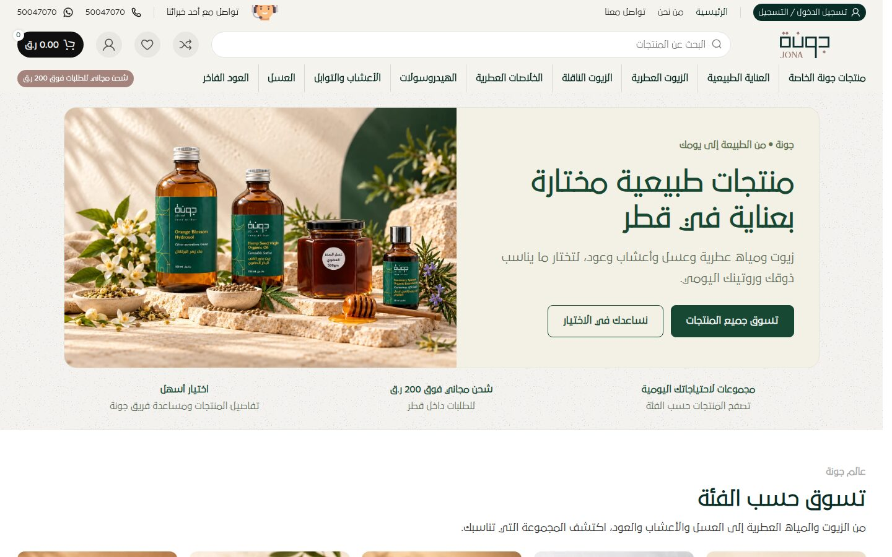
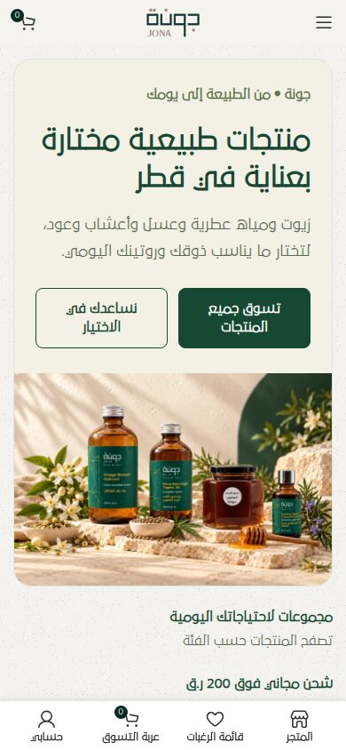
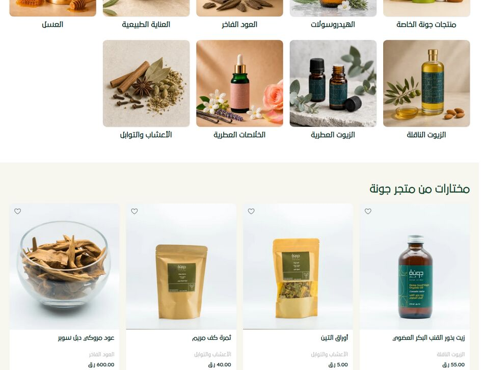
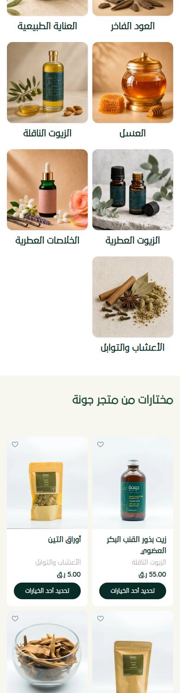

# jona.qa — Website & Aesthetic Audit

**Site:** https://jona.qa/ (Jona Natural Products, جونة للمنتجات الطبيعية)
**Audited:** 2 October 2026, homepage (Arabic, RTL)
**Viewports:** Desktop 1440×900 · Mobile 390×844
**Stack detected:** WordPress 7.1 · WooCommerce 11.1 · Woodmart theme · Elementor / Pro Elements · Polylang (AR/EN) · MyFatoorah · Hostinger Reach · Tawk.to chat

**PDF version:** [jona-qa-aesthetic-audit.pdf](jona-qa-aesthetic-audit.pdf)

---

## Summary

The site has a good base. The deep forest-green and warm cream palette suits a premium natural-products brand, the packaging photography is consistent, and the homepage tells a clear story: hero, categories, featured products, guides, FAQ, footer. RTL layout is handled properly throughout.

Small inconsistencies keep it from looking as premium as its tagline ("حيث تلتقي الطبيعة بالفخامة", where nature meets luxury). The bold text is synthesized because only one font weight is loaded. The site uses two different photography styles. The grids have orphaned tiles, product images vary in height, a clip-art avatar sits in the header, and there are leftovers from the theme demo. Most of these are cheap to fix.

### Scorecard

| Area | Score | Notes |
|---|:-:|---|
| Brand & colour palette | **8/10** | Strong, coherent green/cream. One off-palette dusty-rose pill. |
| Typography | **5/10** | One font file. Faux-bold headings. 17 font sizes. |
| Imagery & photography | **6/10** | Lovely lifestyle shots but they clash with grey studio packshots. Some images are reused. |
| Layout, grid & spacing | **6/10** | Clean sections, but orphan tiles and uneven card heights. |
| Mobile experience | **6/10** | Usable, but hero CTAs wrap and cards are crowded with heavy buttons. |
| Accessibility (visual) | **5/10** | Low-contrast meta text. Zoom is disabled. Missing alt text. |
| Polish & consistency | **5/10** | Demo leftovers, clip-art avatar, mixed text alignment. |
| Performance (perceived) | **5/10** | 81 stylesheets, 66 scripts, about 4.6 MB on desktop. |
| **Overall** | **6/10** | Good foundation. Needs a focused polish pass. |

---

## Screenshots

| Desktop, above the fold | Mobile, above the fold |
|---|---|
|  |  |

Full pages: [desktop](screenshots/desktop-full-page.jpg) · [mobile](screenshots/mobile-full-page.jpg)

---

## 1. Brand & colour

**What works**
- The core palette is restrained and on-brand:
  - Primary: deep forest green `#082C26` (rgb 8,44,38). Used for text, buttons, footer and badges.
  - Secondary: green `#174833`, plus olive accents `#596854` and `#61734F`.
  - Surfaces: cream `#F5F3EE` alternating with white `#FFFFFF`.
- Alternating cream and white section backgrounds give a calm rhythm.
- Forest green text on cream has a 13.5:1 contrast ratio. It is elegant and very readable.

**Issues**
- **Off-palette accent:** the "شحن مجاني للطلبات فوق 200 ر.ق" pill in the header uses dusty rose `#A4847C`. It appears nowhere else. White 11px text on it has only **3.4:1** contrast, which fails WCAG AA.
  → Use the primary green, or a muted gold or olive accent, and promote it to an official brand accent token.
- **Sale red** `#E01020` appears in a few places and is harsh against the earthy palette. The −8% badge already uses green, so the two are inconsistent.
- **Footer logo** sits in a pale rounded box on the dark green footer and looks pasted on.
  → Use a cream or white knockout version of the logo directly on the green.

## 2. Typography

**What works**
- 29LT Bukra is a distinctive modern Arabic typeface that suits the brand. Headings are confident and the H1 is clear.

**Issues**
- **Only one weight is loaded:** `29LT-Bukra-Regular.woff`. Every heading is set to `font-weight: 700`, so the browser **synthesizes bold**. Faux bold on Arabic letterforms looks smudgy and uneven, especially in the 42px H1 and the 32px section titles.
  → Self-host the Bold (and ideally Light or Medium) weights of 29LT Bukra. Serve them as **WOFF2**; the current file is legacy WOFF at 37 KB. Add `<link rel="preload">` for the primary weight.
- **The type scale is too fragmented.** At least 17 distinct sizes are in use on desktop: 11, 12, 13, 13.5, 14, 14.25, 15, 16, 17, 18, 19.5, 20, 24, 28, 30, 32 and 42px. Section H2s alternate between 32, 30 and 28px for no obvious reason.
  → Standardise on a modular scale such as 12 / 14 / 16 / 20 / 24 / 32 / 44. Make every section H2 the same size.
- **Heading hierarchy:** the three hero "feature" items are H3s at 14px, smaller than the product-name H3s at 17px. The semantics and visual weight don't match.
- **Mixed text alignment:** blog/guide cards are **centre-aligned**, while every other section is right-aligned in RTL. It reads as a different template.
  → Right-align the guide cards to match.

## 3. Imagery & photography

**What works**
- The hero and category photography is warm and sunlit, with stone, botanicals and honey dippers. It is aspirational and fits a premium natural brand.
- Jona's packaging is consistent: green labels and kraft pouches. This builds recognition.

**Issues**
- **Two photographic worlds.** Category tiles use warm beige lifestyle scenes. Product cards use cool **grey-gradient studio packshots**. Placed directly one after the other, the jump in colour temperature is jarring.
  → Re-shoot or re-edit packshots on a consistent warm cream/off-white backdrop that matches `#F5F3EE`, or apply a uniform warm grade.
- **Inconsistent product image framing.** Images have different heights and crops. Some cards show a white strip under the photo (for example "زبدة الأفوكادو" and "الملح الانجليزي"), and the product sits at a different scale in each card.
  → Enforce a 1:1 (or 4:5) aspect ratio with `object-fit: cover`/`contain` on a matched background, and keep the product filling about 70% of the frame.
- **Image reuse.** The orange-blossom hydrosol scene appears in the hero, the "تعرف على المياه العطرية" card and the first blog card. Repetition makes the catalogue feel thin.
- **The cartoon call-centre avatar** in the top bar ("تواصل مع أحد خبرائنا") is clip-art style and out of character with the premium aesthetic.
  → Replace it with a line icon, or a real photo of the team or a store.
- On mobile, the "عسل يناسب ذوقك" card crops its image so the honey jar is largely cut off.

## 4. Layout, grid & spacing

**What works**
- Generous whitespace, rounded 12–16px card corners, and subtle borders give a soft, modern feel.
- The section order is logical: discover → browse → learn → reassure (FAQ).

**Issues**
- **Orphaned category tile.** There are 9 categories. On desktop's 5-column grid this leaves a row of 4 with an empty slot. On mobile's 2-column grid, "الأعشاب والتوابل" sits alone on the last row.
  → Feature one category as a wide tile, use a 3×3 grid on desktop, or add a 10th "All products" tile.
  
- **The "اكتشف المزيد" pair is unbalanced.** One card has an image and the other is text-only, so they have very different visual weights side by side.
- **The header is busy.** It has three stacked rows: utility bar, search/logo/actions, and a 10-item mega-nav plus the promo pill. Consider merging the utility bar into the main bar.
- The "تفضل بزيارة المدونة" link in the guides header is a plain underlined link. The other section links use an arrow (←). Make them consistent.

## 5. Mobile experience

- **The hero CTAs wrap onto two lines** ("تسوق جميع / المنتجات", "نساعدك في / الاختيار"), which makes the buttons tall and boxy.
  → Stack the buttons full-width, or shorten the labels (e.g. "تسوق الآن" / "ساعدني أختار").
- **Heavy repeated buttons.** Every product card shows a solid dark-green "تحديد أحد الخيارات" (Select options) pill. Eight identical dark bars dominate the grid more than the products do.
  → Use a lighter outline button, a small "+" icon button, or make the whole card tappable.
- **Cart count badge** "0" overlaps the cart icon in the top-left corner and looks like a glitch. Hide it when the count is 0.
- The fixed bottom tab bar (store / wishlist / cart / account) works well and is clear.
- 35 tap targets are smaller than 32px (wishlist hearts, footer links, social icons).

## 6. Accessibility (visual)

| Check | Result |
|---|---|
| Body text, green on white/cream | ✅ 13.5–15:1 |
| Product category meta text `#A5A5A5` on white | ❌ **2.46:1** (AA needs 4.5:1) → darken to `#6B6B6B` or the olive `#596854` (5.9:1) |
| White on dusty-rose promo pill | ❌ 3.4:1 at 11px |
| Pinch-zoom | ❌ `maximum-scale=1.0, user-scalable=no` blocks zoom. Remove it. |
| Image alt text | ⚠️ 23 of 30 `` tags in the HTML have no meaningful alt, including the logo and all 9 category images |
| Links with no accessible name | ⚠️ 7 on desktop (icon-only links) |
| Single `<h1>` | ✅ |

## 7. Polish & consistency

- **Theme-demo leftovers:**
  - The English homepage URL is `/en/home-furniture2-english/`, from Woodmart's "Furniture 2" demo.
  - The footer uses `wd-furniture-phone.svg`.
  - The English page's `<title>` is still in Arabic.
  → Rename the slug to `/en/`, set a proper English title, and swap the demo assets.
- **No meta description and no Open Graph tags.** Links shared on WhatsApp or Instagram (key channels in Qatar) show no image or description. Add `og:image` (the hero shot), `og:title` and `og:description`.
- Payment-method icons in the footer bottom bar are small white tiles that look uneven. Present them as a single neat monochrome row.

## 8. Performance (perceived quality)

| Metric (desktop, measured in sandbox) | Value |
|---|---|
| Requests | ~191 (81 CSS · 66 JS · 38 images) |
| Page weight | ~4.6 MB desktop / ~3.2 MB mobile |
| DOMContentLoaded | ~5.8 s |
| Load event | ~6.6 s |

- 81 separate stylesheets and 66 scripts are typical of an unoptimised Woodmart + Elementor stack.
  → Enable CSS/JS combining and deferral (LiteSpeed Cache on Hostinger), and disable unused Woodmart modules and Elementor widgets.
- **Oversized images:**
  - The logo is a 1439×393 PNG displayed at about 197×64.
  - Blog images are 1024px wide, displayed at 336px.
  - The hero image is 1439px wide, displayed at 633px.
  → Serve correctly sized WebP/AVIF images and convert the logo to SVG.
- Timings were measured from a sandboxed cloud browser and are indicative only. Confirm them with PageSpeed Insights.

---

## Prioritised action plan

| # | Fix | Impact | Effort |
|---|---|:-:|:-:|
| 1 | Load the real **29LT Bukra Bold** (WOFF2) so headings are no longer faux bold | High | Low |
| 2 | Re-grade or re-shoot **product packshots on a warm cream backdrop**, and enforce one aspect ratio | High | Med |
| 3 | Fix the **category grid orphan** (3×3 grid, or add an "All products" tile) | Med | Low |
| 4 | Darken the **grey meta text** and fix the promo pill colour/contrast | Med | Low |
| 5 | Replace the **clip-art avatar** with a line icon. Use a knockout logo in the footer. | Med | Low |
| 6 | Mobile: **stack the hero CTAs** and lighten the "Select options" buttons. Hide the cart badge at 0. | Med | Low |
| 7 | Consolidate the **type scale**. Right-align the guide cards. | Med | Low |
| 8 | Add a **meta description + Open Graph image** | Med | Low |
| 9 | Remove **demo leftovers** (`home-furniture2-english`, furniture icons). Fix the EN title. | Low | Low |
| 10 | Re-enable **pinch-zoom**. Add alt text to the logo and category images. | Med | Low |
| 11 | Combine/defer CSS and JS. Resize the logo and blog images. | Med | Med |

---

### Methodology & caveats
- I rendered the homepage in headless Chromium (Playwright) at desktop and mobile widths, and extracted computed styles for fonts, colours, sizes, headings, buttons and images. Contrast was calculated with the WCAG 2.x formula.
- The audit environment's network proxy blocked a few third-party resources: Tawk.to chat, the Hostinger Reach embed, and the MyFatoorah/Google Pay payment-icon images. They therefore appear broken in the screenshots. **These may load correctly for real visitors** and are not counted as site defects here.
- The audit covers the Arabic homepage only. Product, category, cart and checkout pages were not reviewed.
